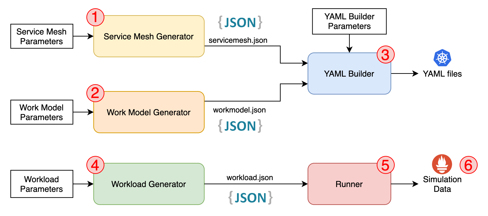

# Building Tools

### Table of Content
* [Introduction](/README.md)
* [Microservice Model](/Docs/MicroserviceModel.md#Microservice-Model)
  * [Service Cell](/Docs/MicroserviceModel.md#Service-Cell)
  * [Internal Service](/Docs/MicroserviceModel.md#Internal-Service)
  * [External Services](/Docs/MicroserviceModel.md#External-Services)
  * [Custom Functions](/Docs/MicroserviceModel.md#Custom-Functions)
* [**Building Tools**](/Docs/BuildingTools.md#Building-Tools)
  * [Service Mesh Generator](/Docs/BuildingTools.md#Service-Mesh-Generator)
  * [Work Model Generator](/Docs/BuildingTools.md#Work-Model-Generator)
  * [Workload Generator](/Docs/BuildingTools.md#WorkLoad-Generator)
  * [Runner](/Docs/BuildingTools.md#Runner)
* [Deployment](/Docs/Deployment.md#Deployment)
    * [Kubernetes](/Docs/Deployment.md#Kubernetes)
      * [K8s Yaml Builder](/Docs/Deployment.md#K8s-Yaml-Builder)
      * [K8s Deployer](/Docs/Deployment.md#K8s-Deployer)
    * [Further Works](/Docs/Deployment.md#Further-Works)
* [Monitoring](/Monitoring/README.md#Monitoring)
    * [Prometheus](/Monitoring/README.md#Prometheus)
    * [Grafana](/Monitoring/README.md#Grafana)
* [Getting Started](/Docs/GettingStarted.md#Getting-Started)
    * [Example](/Docs/GettingStarted.md#Example) - A step by step walkthrough
    * [K8s Autopilot](/Docs/GettingStarted.md#K8s-Autopilot) - The lazy shortcut
---

Thanks to its modular design you can perform the following steps individually:

1. Create the Microservice Mesh (Service Mesh)
2. Establish the behavior of each service (Work Model)
3. Combine the Service Mesh and Work Model into K8s deployable YAML files
4. Generate the simulation workload (Work Load Generator)
5. Perform the simulation across the Microservice Mesh
6. Retrieve the simulation data you are interested in

---
## Service Mesh Generator

The ServiceMeshGenerator (`RunServiceMeshGen.py`) generates a `servicemesh.json` file that describes the service mesh of the Microservice Application.

To learn more go to [Service Mesh Generator](/ServiceMeshGenerator/README.md#Service-Mesh-Generator).

---
## Work Model Generator

The WorkModelGenerator (`RunWorkModelGen.py`) generates a `workmodel.json` file that describes the work model of the Microservice Application.

To learn more go to [Work Model Generator](/WorkModelGenerator/README.md#Work-Model-Generator).

---
## WorkLoad Generator
The WorkLoadGenerator (`RunWorkLoadGen.py`) generates a `workload.json` file that describes the work load of the Microservice Application.

To learn more go to [WorkLoad Generator](/WorkLoadGenerator/README.md#WorkLoad-Generator).

---
## Runner
The `Runner.py` is in charge of executing one or more *workloads* and save the simulation results as an output file. 

To learn more go to the [Runner](/Runner/README.md#Runner).
